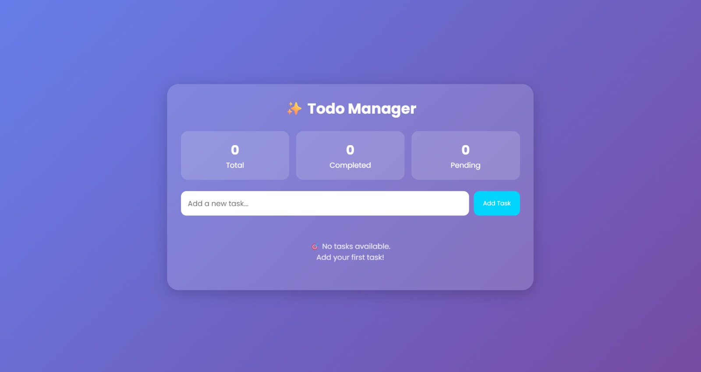
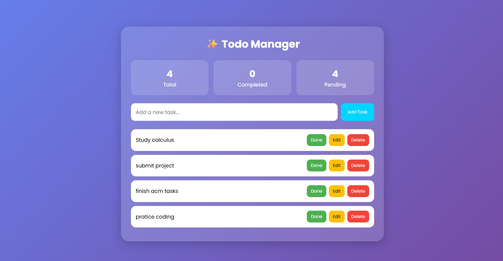
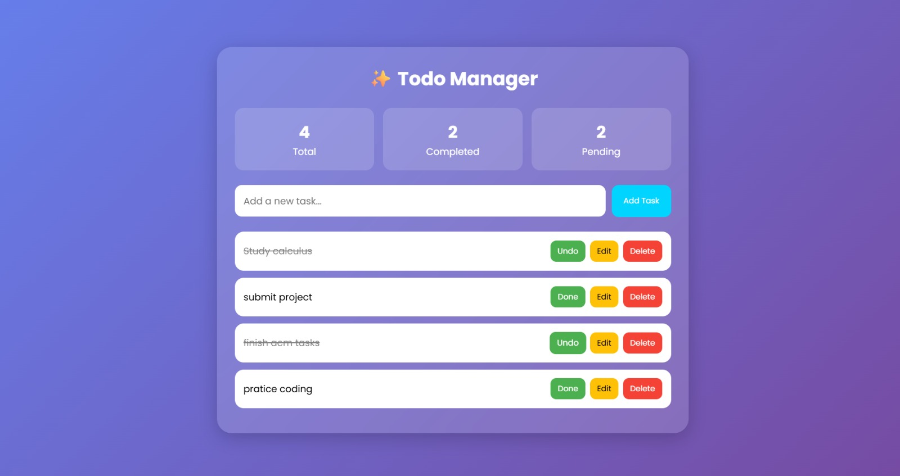

# Basic Website - Todo Manager

## Task Description

The objective of this task was to develop a responsive and interactive web application using HTML, CSS, and JavaScript. I created a Todo Manager that allows users to efficiently manage their daily tasks through a simple and user-friendly interface.

## Implementation

The application was built using:

* HTML for the webpage structure
* CSS for styling, animations, and responsive design
* JavaScript for dynamic functionality and task management

Features implemented:

* Add new tasks
* Edit existing tasks
* Mark tasks as completed or pending
* Delete tasks
* Real-time statistics showing:

  * Total tasks
  * Completed tasks
  * Pending tasks
* Keyboard support using the Enter key
* Responsive design for mobile and desktop devices
* Glassmorphism-inspired user interface with animations

## What I Learned

* Event handling and user interactions
* Working with arrays and objects in JavaScript
* Creating responsive layouts using CSS Grid and Flexbox
* Implementing CRUD-like operations on frontend data
* Using CSS animations and modern UI design techniques

## Screenshots

### Main Interface

### Task Management

### Responsive Design

