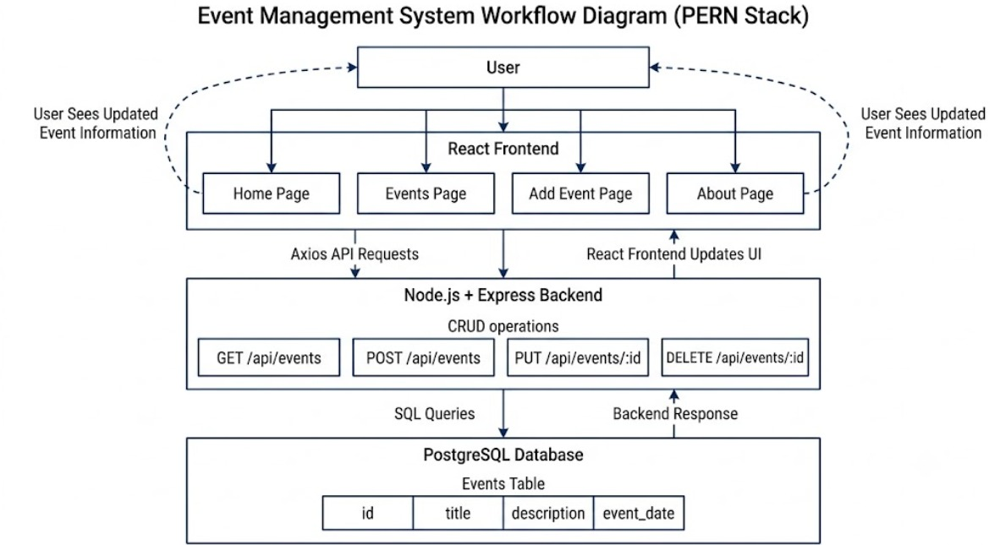
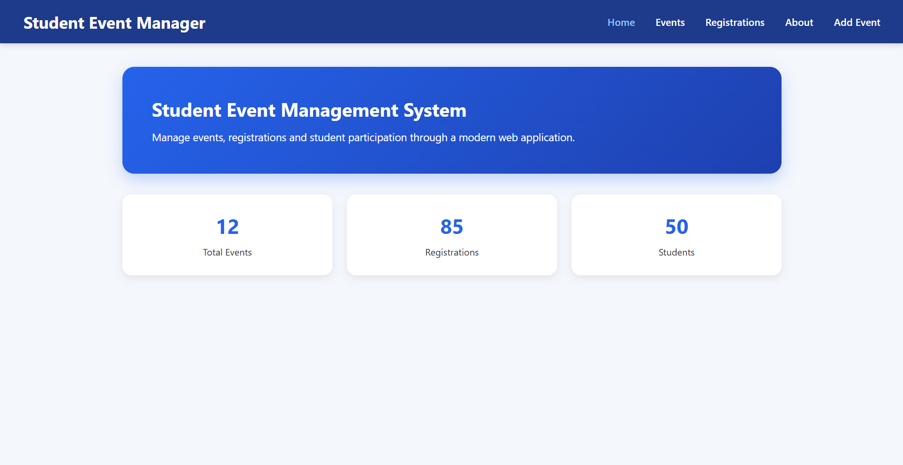
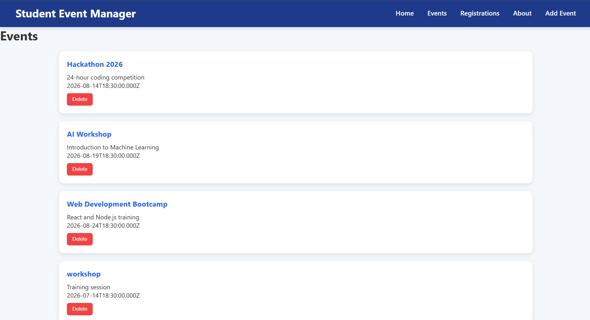
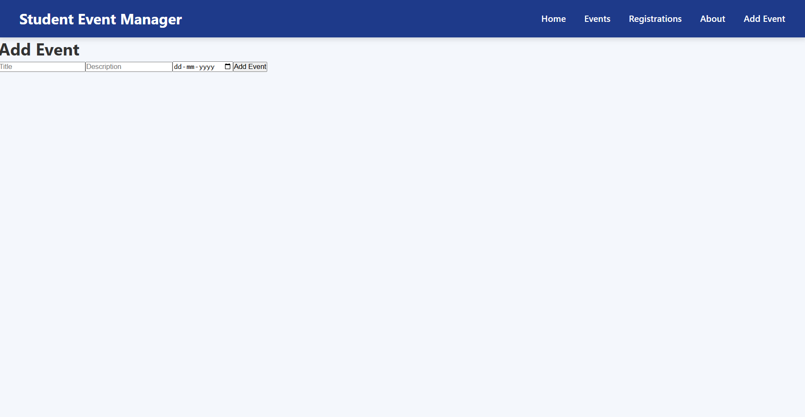
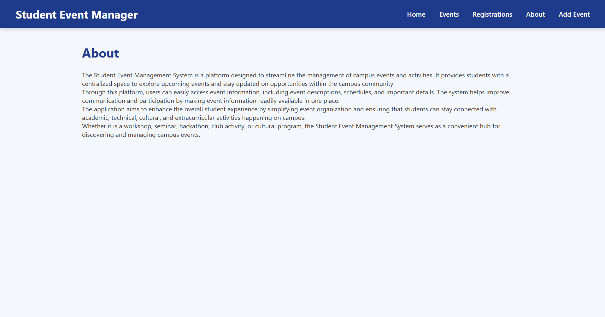
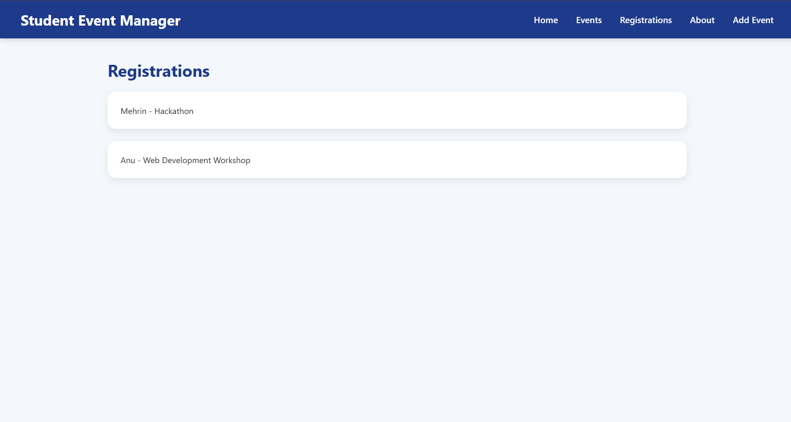

# PERN Management System

## Task Description

Develop a full-stack management system using PostgreSQL, Express.js, React.js, and Node.js. The application follows an Event Management theme and supports complete CRUD operations through backend APIs.

## Implementation

Technologies Used:

* PostgreSQL
* Express.js
* React.js
* Node.js
* Axios

Features:

* View Events
* Add Events
* Update Events
* Delete Events
* Multiple Pages with Routing
* Frontend and Backend Integration
* PostgreSQL Database Connectivity

## What I Learned

* Building REST APIs using Express.js
* Connecting React frontend with backend APIs
* PostgreSQL database operations
* CRUD implementation
* React routing and component management
* Full-stack application development

## Figma Wireframe

Figma design link is included in the repository.

## Workflow Diagram

## Database Schema

Database schema is included as database_schema.sql.

## Screenshots

### Home Page

### Events Page

### Add Event Page

### About Page

### Registrations

